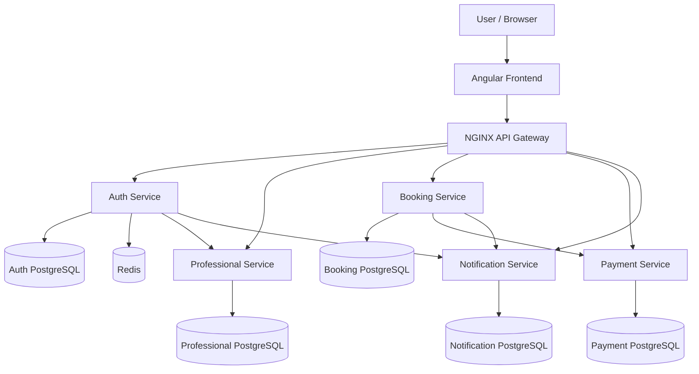

```mermaid
flowchart TD
    U[User / Browser] --> F[Angular Frontend]
    F --> G[NGINX API Gateway]

    G --> A[Auth Service]
    G --> P[Professional Service]
    G --> B[Booking Service]
    G --> Pay[Payment Service]
    G --> N[Notification Service]

    A --> AD[(Auth PostgreSQL)]
    P --> PD[(Professional PostgreSQL)]
    B --> BD[(Booking PostgreSQL)]
    Pay --> PaD[(Payment PostgreSQL)]
    N --> ND[(Notification PostgreSQL)]

    A --> R[(Redis)]

    B --> Pay
    B --> N
    A --> P
    A --> N
```