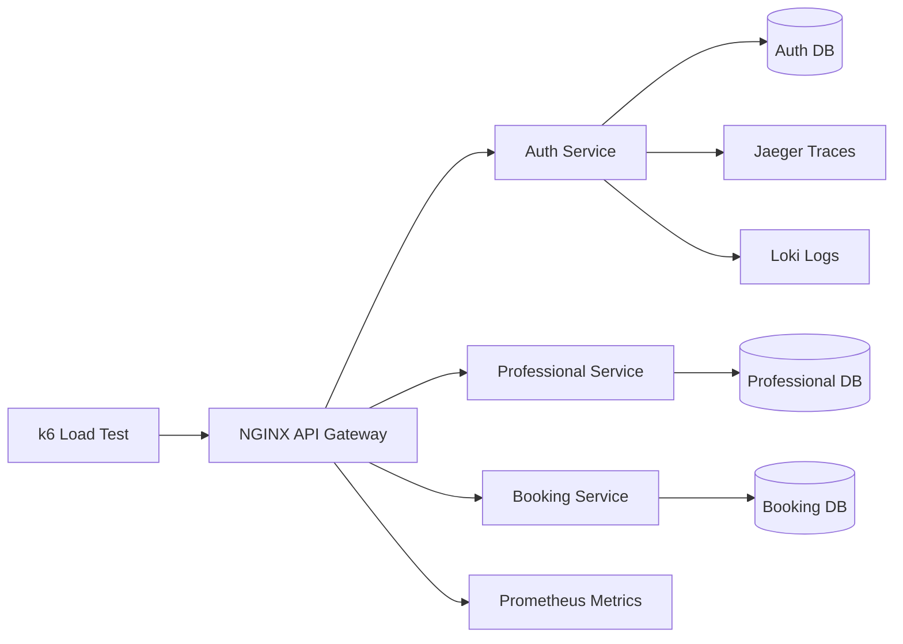

```mermaid
flowchart LR
    K[k6 Load Test] --> G[NGINX API Gateway]
    G --> A[Auth Service]
    G --> P[Professional Service]
    G --> B[Booking Service]

    A --> DB1[(Auth DB)]
    P --> DB2[(Professional DB)]
    B --> DB3[(Booking DB)]

    G --> PR[Prometheus Metrics]
    A --> J[Jaeger Traces]
    A --> L[Loki Logs]
```